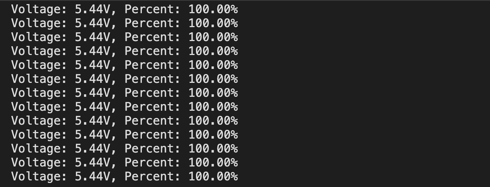

# Battery Voltage and Level Measurement using ADC
This repository contains code for measuring battery voltage and level using an ADC (Analog-to-Digital Converter). The code supports both ESP32 and Arduino platforms.

# Introduction
This code is designed to measure the voltage and level of a battery using an ADC. It includes implementations for both ESP32 and Arduino environments. The measured battery voltage is used to estimate the battery level, which can be useful for monitoring battery health and determining when to recharge or replace the battery.

# Usage
To use this code in your project, simply copy the provided header file (BatReader.h) and source file (BatReader.cpp) into your project directory. Then, include the header file in your project and use the provided functions to initialize the battery reader and obtain battery information.

# Setup
Before using the code, it is recommended to adjust the preset values according to your specific battery voltage measurement setup. This includes setting up the voltage divider circuit based on your measured battery voltage. Additionally, you may need to adjust other preset values in the code to ensure accurate voltage and level measurements.

# Supported Platforms
This code is compatible with both ESP32 and Arduino platforms. It includes separate implementations for each platform to ensure proper functionality and compatibility.

# Notes

When using this code, please consider the characteristics of the ADC on ESP32 and Arduino. Also, keep in mind that this method may not provide precise measurements of voltage and capacity, but rather an estimation suitable for less demanding scenarios. In practical applications, it is advisable to conduct testing and adjustments according to specific requirements, and consider using more accurate measurement methods to ensure the accuracy of the results.